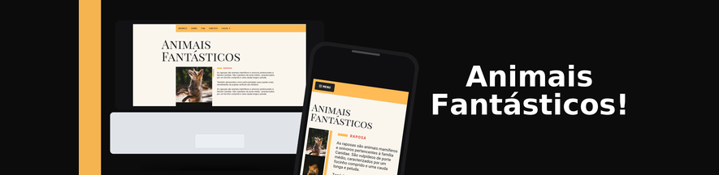

# Animais Fantásticos!

Animais Fantásticos é uma landing page responsiva que apresenta curiosidades sobre animais em um layout elegante. Traz tipografia serifada, paleta creme/laranja e imagens em destaque, com versão desktop e mobile. O objetivo é praticar HTML, JavaScritp e CSS com responsividade, destacando conteúdo limpo e leitura agradável.

## 📦 Tecnologias usadas:

* 
* 
* 

# Link

* (https://abediaslor.github.io/Projeto-Animais/)

## 👷 Autores

* **AbediasLOR** - *Autor do projeto* 
  

## 💡 Expressões de gratidão

* Projeto desenvolvido durante uma das aulas da Origamid.

## Meu Linkedin!
* 
